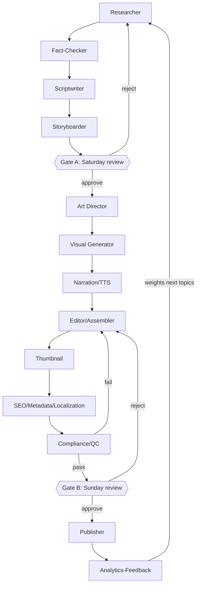

# History of Earth — Master Plan (Part 1 of 3: Strategy & Content Architecture)

# "History of Earth" — Master Build Spec v2
**Prepared:** Sept 17, 2026 · **Target:** YPP-eligible before Feb 1, 2027 entry-bar increase

> **Verification flags used throughout:** 🟢 = confirmed via web search today · 🟡 = general knowledge, stable/low-risk, worth a quick Studio/doc check · 🔴 = specific number I'm not confident in — verify before you build logic around it. Per your standing instructions, I'm not presenting 🔴 items as settled fact.

---

## PHASE 1.1 — STRATEGY & MONETIZATION RUNWAY

### YPP requirements (🟢 verified today)

| Tier | Subs | Watch hours (365d) | OR Shorts views (90d) | Unlocks |
|---|---|---|---|---|
| Early access | 500 | 3,000 | 3,000,000 | Fan funding, Shopping |
| Full YPP — **current** | 1,000 | 4,000 | 10,000,000 | Ads, Premium rev-share |
| Full YPP — **new applicants from Feb 1, 2027** | 1,000 | **8,000** | **20,000,000** | Ads, Premium rev-share |
| Shorts Creator Pool — ongoing (from Feb 1, 2027) | n/a (already in YPP) | n/a | 10,000,000 trailing 90d | Keep earning Shorts ad/sub revenue |

Key implications:
- **Existing YPP members are grandfathered** — the entry bar only bites new applicants after Feb 1, 2027. This is the whole reason your deadline matters: apply and get accepted *before* that date and you lock in the easier 4,000-hour / 10M-Shorts bar permanently for entry purposes.
- The 10M-Shorts "Creator Pool" rule is a *separate, ongoing* eligibility test for Shorts revenue specifically, not an entry requirement — don't design your dashboard to conflate the two.
- **Target path: long-form watch hours, not Shorts-view volume**, for entry. 4,000 hours in 12 months is achievable with 8–14 min episodes at modest view counts; 10M Shorts views in 90 days is a much higher bar for a cold-start channel with no existing audience.

### Runway math (assumptions labeled)

Working backwards from **Jan 15, 2027** (leaving a 2-week buffer before the Feb 1 change) as your "apply" date:

- Need: 1,000 subs + 4,000 watch hours (trailing 12mo) — but since the channel starts now, effectively 4,000 hours accumulated *ever* within the trailing window.
- 4,000 hours = 240,000 minutes. At an assumed (🔴 **unverified — your own historical baseline once you have one, not an industry constant**) average view duration of ~3–4 min per 10-min video for a new educational channel, that's roughly 60,000–80,000 total views needed across the catalogue's lifetime, concentrated in your top-performing episodes (view distribution on new channels is typically power-law, not even).
- Publishing math: 90-day calendar (Phase 1.2) × weekend-gated batching → target **2 long-form + 4–6 Shorts per week**, meaning ~13 weeks gets you ~26 long-form videos and ~65–78 Shorts by the 90-day mark.
- **This view/watch-hour assumption is the single biggest unknown in the whole plan.** I'm not going to dress it up as more certain than it is — you should treat weeks 1–4 as a live calibration period and recompute the required weekly output once you have real numbers, not projected ones.

### Kill-criteria (pivot signals)

| Checkpoint | Metric | Kill/pivot trigger |
|---|---|---|
| Week 4 | Avg views/long-form video | <100 views after 14 days on 4+ consecutive uploads → revisit thumbnail/title/hook, not format |
| Week 8 | CTR (Studio Analytics) | <2% sustained → art direction or title formula problem, test variants |
| Week 8 | Avg view duration | <20% of runtime → script pacing problem; shorten episodes, front-load hook |
| Week 12 | Cumulative watch hours vs. required pace | <50% of the linear pace needed to hit 4,000 hrs before your apply date → either accelerate publish cadence, shift more budget/time to Shorts funnel, or accept a later YPP application date (don't chase the deadline into policy-violating growth tactics) |

---

## PHASE 1.2 — CONTENT ARCHITECTURE

### Pillars (using your six, with one addition flagged as optional)

Your six pillars (Landscape / Map / Air & Ocean / Life Then / Leap / Ending) are sound — each is a distinct visual and narrative mode, which directly serves your inauthentic-content variation requirement. Optional 7th pillar: **"The Reckoning"** — a periodic cross-era recap ("what have we learned across 3 eras") for audience retention and as a Shorts-compilation source. Add it only if pacing feels repetitive after ~20 episodes; don't build for it on day one.

### Content map (framework + sample — not hand-listing all 80–150 here)

Structure per episode entry:
```
era | pillar | working_title | hook | runtime_target | originality_note
```
Sample (Hadean era, all 6 pillars):

| Era | Pillar | Working title | Hook (1 line) | Runtime | Originality note |
|---|---|---|---|---|---|
| Hadean | Landscape | "A World of Fire and Rain" | Earth had no solid ground for 500 million years — here's what "no ground" actually looked like | 9 min | Cold open: reverse-chronology from ISS view of modern Earth dissolving backward into a magma ocean |
| Hadean | Map | "The Planet With No Plates" | Before continents, there was one churning shell — this is what came before Pangaea's ancestors | 8 min | Structured as a "detective" narration — what evidence tells us this, not just what happened |
| Hadean | Air & Ocean | "The Sky Was Poison and the Rain Never Stopped" | Steam, sulfur, and a 100+ atmosphere of pressure | 8 min | Data-overlay visual style vs. narrative style used elsewhere |
| Hadean | Life Then | "The Planet Before Life" | Nothing lived here — but the ingredients were already arriving | 7 min | First-person "if you stood here" framing |
| Hadean | Leap | "When Rocks Learned to Cool" | Zircon crystals are the oldest witnesses on Earth | 9 min | Object-biography structure (follows one mineral grain) |
| Hadean | Ending | "The Bombardment That Almost Ended Everything" | The Late Heavy Bombardment, if it happened | 8 min | Explicitly flags scientific uncertainty/debate — a recurring "contested science" segment format |

The **full 80–150 row catalogue** should be generated programmatically by the Researcher/Scriptwriter agents (Phase 1.4) against this schema — hand-authoring 150 rows here would just be me guessing at hooks I can't fact-check yet. I'd rather hand you a correct 6-row template than a fabricated 150-row list.

### 90-day publishing calendar — sequencing logic

**Not strictly chronological.** Recommended order:
1. **Weeks 1–2:** Cold open with high-hook eras — Cretaceous (dinosaurs, extinction) and Cambrian (explosion of life) pull search/discovery traffic even from viewers with zero context. This seeds the algorithm with your best CTR data early.
2. **Weeks 3–6:** Backfill Hadean → Archean → Proterozoic in order, now that you have returning subscribers who'll follow the "origin story" framing, plus new-viewer traffic still landing on the high-hook episodes from weeks 1–2.
3. **Weeks 7–13:** Continue chronologically forward (Cambrian→Quaternary), interleaving Shorts drawn from each long-form episode's most visual 30–45 seconds.
- Trade-off: strict chronology tells the best *story* arc for subscribers who binge from episode 1, but a cold-start channel has no subscribers to binge — you're optimizing for discovery first, narrative arc second, and playlist ordering (not upload order) delivers the chronological experience to anyone who arrives later.

### Variation matrix (blocking QC gate — must differ across consecutive uploads)

| Dimension | Options to rotate |
|---|---|
| Cold-open type | Reverse-chronology / direct question / "you are there" / contested-science teaser / object-biography |
| Narration register | Documentary-authoritative / detective-investigative / first-person immersive |
| Visual treatment | Parallax scene / data-overlay infographic / character-driven vignette / map-animation |
| Structure | Problem→evidence→answer / chronological walkthrough / compare-then-contrast (era vs era) |
| Pacing | Slow-build single-thread / fast-cut multi-fact montage |

QC rule (pseudocode in Phase 1.6): no two **consecutive** uploads may share the same value on more than 2 of these 5 dimensions.

---
# History of Earth — Master Plan (Part 2 of 3: Tool Stack & Agent Architecture)

## PHASE 1.3 — FREE TOOL STACK (Windows/AMD/no-CUDA constrained)

🔴 **Every specific free-tier quota number below needs verification before you build rate-limit logic against it** — these change frequently and I do not have high confidence in current exact figures for most of them. I'm naming real, currently-existing tools; I'm not fabricating limits, I'm flagging that you must pull current numbers from each provider's pricing page at build time.

| Stage | Primary (free tier) | Fallback | Automation method | Local/Cloud | Notes |
|---|---|---|---|---|---|
| Research/scripting LLM | Google Gemini (API free tier) | Local small model via Ollama/ONNX-DirectML on iGPU (slow) | REST API via Python | Cloud primary | 🔴 verify current free-tier request/token caps in AI Studio before designing batch size |
| Fact-check/source retrieval | Wikipedia API + Google Scholar/PubMed search (manual citation harvesting by agent) | Semantic Scholar API | Python `requests` | Cloud | Agent must **block** on any claim without a resolvable citation URL — do not let it invent one |
| Storyboard/shot lists | Text-only output from scripting LLM, structured as JSON shot list | — | Same LLM call, structured output prompt | Cloud | No dedicated storyboard tool needed at this stage |
| 2D keyframe generation, style-locked | Cloud image-gen tool with a free tier (e.g. current Gemini/ImageFX-class tool, or Bing Image Creator-class tool) — 🔴 confirm which currently offers free-tier commercial-use output, this shifts often | — | Browser automation (Playwright) if no API, else REST | Cloud | **Style-locking approach:** fixed reference sheet (character model sheet + palette swatch + typography board) re-injected as image input/reference on every generation call, NOT relying on "seed" numbers alone since seeds don't guarantee style-lock across different subjects. Maintain a `style_bible.json` with locked hex codes, character turnaround refs, and a written style-prompt fragment appended to every prompt verbatim. |
| Animation | **Procedural motion graphics via code** (SVG + CSS/JS animation, or Python + `manim`/custom FFmpeg filter chains for parallax/2.5D pans on static illustrated layers) — chosen as primary specifically because it's CUDA-free and infinitely reproducible | Cloud image-to-video tool free tier (🔴 unverified current limits) for occasional hero shots only | Python/FFmpeg, CLI | **Local (CPU)** | This is your biggest cost-avoidance lever: parallax/Ken-Burns-style pans on layered flat illustration look intentional (matches "motion graphics feel") and cost zero cloud quota |
| TTS narration | Cloud TTS with a free tier and clear commercial-use license (e.g. current Google Cloud TTS free tier, or Microsoft Edge TTS — 🔴 confirm current commercial-use terms, this is the detail people get wrong) | Local `piper` TTS (fully offline, CPU, permissively licensed voices) | Python | Cloud primary, local fallback | Local `piper` is a strong fallback specifically because it needs zero network and no CUDA — good "no quota anxiety" option even if voice quality is a notch below cloud |
| Music & SFX | CC0 sources: Pixabay Audio, YouTube Audio Library (explicitly royalty-free for YouTube use) | Freesound.org (CC0-filtered only) | Manual curation + licence ledger entry per asset | — | Filter to CC0/CC-BY only; log every asset's licence in the ledger regardless of source |
| Editing/assembly + caption burn-in | FFmpeg (CLI) + Python orchestration (MoviePy or direct ffmpeg-python bindings) | — | Fully scripted, CPU, overnight batch | **Local (CPU)** | This is 100% local and free — no cloud dependency at all for this stage |
| Thumbnails | Same image-gen pipeline as keyframes, reusing style bible | Manual composite in a free editor (Krita/GIMP) if generation output needs cleanup | Scripted or manual | Cloud + local touch-up | |
| Upload/metadata/scheduling | YouTube Data API v3 | Manual upload via Studio if quota exhausted | Python `google-api-python-client`, OAuth | Cloud | See quota section below — 🔴 verify current bucket structure before writing scheduler logic |
| Analytics feedback | YouTube Analytics API (part of Data API v3 surface) | Manual Studio dashboard read | Python | Cloud | Feed CTR/avg-view-duration back into Researcher agent's topic-selection weighting |

**Where free tiers bottleneck at scale, and the workaround:**
- Cloud image-gen and cloud LLM calls will hit free-tier ceilings before FFmpeg/local assembly ever does — the fix is **batch on weekends, queue overnight**, not account rotation (rotating accounts to evade rate limits can violate most providers' ToS — don't build that in).
- API quota (upload/search) is the other likely wall — see below.

### YouTube Data API v3 quota — what to design against

🟢 Confirmed baseline: **10,000 units/day per Google Cloud project**, resets midnight Pacific Time, free (no billing tier).
🔴 **Unverified/in-flux:** I found multiple sources claiming that as of roughly mid-2026 `videos.insert` (upload) and `search.list` were moved into their **own separate small daily buckets** (reported as ~100 calls/day each, at ~1 unit/call) rather than drawing from the shared 10,000-unit pool — historically `videos.insert` cost up to 1,600 units and `search.list` cost 100 units *from* that shared pool. Sources disagree on exact dates and mechanics of this transition, and it's recent enough that I don't trust it as settled. **Action item for you:** check Google Cloud Console → APIs & Services → YouTube Data API v3 → Quotas directly before writing the Publisher agent's rate-limiter — the difference between "uploads share a 10,000-unit pool with everything else" and "uploads have their own 100/day bucket" changes how aggressively your other agents can call metadata/search endpoints on the same day you publish.
- Design the Publisher agent to **read its actual quota cost from the API response headers/error codes at runtime** and back off adaptively, rather than hardcoding a unit-cost table that may already be stale.

---

## PHASE 1.4 — AGENT ARCHITECTURE

### Agents

| Agent | Purpose | Inputs | Outputs | Tools | Failure mode / retry | Feeds gate |
|---|---|---|---|---|---|---|
| Orchestrator | Owns state machine, schedules agent runs, enforces weekday-batch/weekend-gate rhythm | SQLite state, config YAML | Task dispatch | APScheduler or cron | Crash mid-run → resume from last committed state row | Both |
| Researcher | Pulls era/pillar facts, drafts claim list with candidate sources | Content map row | Draft fact list + candidate URLs | Gemini API, Wikipedia/Scholar search | No resolvable source found → flag claim, do not fabricate, escalate to human review queue | Gate A |
| Fact-Checker | Validates each claim has a real, resolvable citation; blocks unsourced claims | Researcher output | Approved fact list or rejection list | Same search tools, URL-reachability check | Source URL unreachable → mark unverified, exclude claim from script | Gate A |
| Scriptwriter | Turns approved facts into narration script + on-screen text | Fact-checked facts, variation-matrix constraint from last N episodes | Script (timed), shot-list JSON | Gemini API | Script exceeds runtime target → auto-trim lowest-priority beats first | Gate A |
| Storyboarder | Converts shot-list into per-shot image prompts referencing style bible | Script shot-list | Storyboard JSON (prompt + camera move per shot) | Same LLM | — | Gate A |
| Art Director | Maintains/enforces style_bible.json; validates generated frames against it before they proceed | Style bible, generated frame | Pass/fail + regeneration prompt if fail | Image-gen API, simple perceptual hash/palette-check script | Style drift detected → regenerate with stronger style-prompt weight, cap at 3 retries then escalate | Gate B |
| Visual Generator | Calls image-gen API per shot | Storyboard JSON | PNG frames per shot | Cloud image-gen API/browser automation | Rate limit hit → queue remainder for next available window | Gate B |
| Narration (TTS) | Renders script to audio | Final script | WAV/MP3 narration track | Cloud TTS or local piper fallback | Cloud quota exhausted → fall back to local piper automatically | Gate B |
| Editor/Assembler | Composites frames + parallax motion + narration + music + captions into final MP4 | Frames, audio, SRT | Rendered MP4 + burned/soft captions | FFmpeg/MoviePy | Render fail → log ffmpeg stderr, retry once, else escalate | Gate B |
| Thumbnail | Generates 2–3 thumbnail candidates per episode | Style bible, episode hook | Thumbnail PNGs | Image-gen API | — | Gate B |
| SEO/Metadata & Localization | Generates title/description/tags, SRT translation calls | Script, keyword research notes | Metadata JSON, translated SRT files | YouTube Data API (captions.insert), keyword tool | Translation API quota exhausted → queue for next day | Gate B |
| Publisher | Uploads video, sets metadata, schedules publish time, manages caption tracks | Approved video + metadata JSON | Live/scheduled video, upload confirmation | YouTube Data API v3 (OAuth) | Quota exceeded → queue and retry after reset, never retry-storm | Gate B (executes after) |
| Analytics-Feedback | Pulls CTR/watch-time/retention per published video weekly | YouTube Analytics API | Performance CSV → feeds Researcher's next topic weighting | YouTube Analytics API | — | Ongoing (not gated) |
| Compliance/QC | Runs AI-disclosure rule, originality/variation check, general-audience guard, licence-ledger completeness check | All prior outputs | Pass/fail + itemized report | Rule-based Python (pseudocode below) | Any fail = **hard block**, cannot reach Gate B regardless of other agents' status | Blocks Gate B |

### State machine

```
idea → researched → fact_checked → scripted → [GATE A: human review]
  → storyboarded → art_directed → rendered_frames → narrated
  → assembled → compliance_checked → [GATE B: human review]
  → scheduled → published → analysed
```
Persist every transition as a row in SQLite (`episodes` table: id, era, pillar, state, timestamps, artifact paths, gate notes) so a Wednesday crash resumes from the last committed state, not from scratch.

### The two weekend gates

- **Gate A (Saturday, target ~5–8 min/episode):** Orchestrator presents an HTML review sheet listing 6–8 episodes' worth of: final script text, storyboard thumbnail strip, proposed title, and a diff view against the variation matrix (flags if this episode repeats too many dimensions from its neighbors). You approve/reject/annotate per episode in one pass; rejections route back to `researched` with your notes attached as a re-prompt.
- **Gate B (Sunday, target ~5–8 min/episode):** Review sheet shows the rendered video (embedded player or thumbnail + link to local file), the 3 thumbnail candidates, full metadata JSON (title/description/tags/captions languages), the Compliance/QC report (pass/fail per rule), and the proposed publish datetime. Approve schedules it; reject sends it back to `assembled` or further if the issue is script-level.

### Mermaid diagram



### Repo structure

```
history-of-earth/
├── .env                          # API keys, OAuth client secrets (gitignored)
├── config.yaml                   # global config (see schema below)
├── style_bible.json              # locked palette/typography/character refs
├── state.db                      # SQLite state machine
├── content_map.csv               # full 80-150 episode catalogue
├── agents/
│   ├── orchestrator.py
│   ├── researcher.py
│   ├── fact_checker.py
│   ├── scriptwriter.py
│   ├── storyboarder.py
│   ├── art_director.py
│   ├── visual_generator.py
│   ├── narration.py
│   ├── editor_assembler.py
│   ├── thumbnail.py
│   ├── seo_metadata.py
│   ├── compliance_qc.py
│   ├── publisher.py
│   └── analytics_feedback.py
├── pipeline/
│   ├── state_machine.py
│   └── db_schema.sql
├── review/
│   ├── gate_a_template.html
│   └── gate_b_template.html
├── assets/
│   ├── music_sfx/                # CC0-only, per-file licence noted in ledger
│   ├── voices/                   # piper voice models (local fallback)
│   └── licence_ledger.csv
├── output/
│   └── <episode_id>/             # frames, audio, final mp4, srt, thumbnails
└── requirements.txt
```

### Config schema (YAML)

```yaml
channel:
  name: ""
  brand_account: true
  timezone: "Asia/Kolkata"
schedule:
  weekday_mode: "batch_unattended"
  weekend_gates: ["saturday", "sunday"]
  buffer_weeks_target: 3
tools:
  llm_provider: "gemini"
  image_provider: "PLACEHOLDER_VERIFY_CURRENT_FREE_TIER"
  tts_provider_primary: "cloud_tts_PLACEHOLDER"
  tts_provider_fallback: "piper_local"
compliance:
  ai_disclosure_mode: "auto_evaluate"   # see pseudocode
  kids_guard_strict: true
  variation_matrix_max_shared_dims: 2
youtube_api:
  quota_daily_units: 10000            # 🔴 re-verify bucket structure before relying on this
  upload_daily_cap: 100                # 🔴 unverified current figure — confirm in Cloud Console
```

**Secrets handling:** `.env` holds `YOUTUBE_CLIENT_ID`, `YOUTUBE_CLIENT_SECRET`, `GEMINI_API_KEY`, image/TTS provider keys. OAuth token flow: one-time browser-based consent (`google-auth-oauthlib` `InstalledAppFlow`) generates a refresh token stored encrypted at rest (not committed); Publisher agent refreshes access tokens silently on each run. Never log full tokens; log only expiry and scope.

---
# History of Earth — Master Plan (Part 3 of 3: SEO, Compliance & Antigravity Prompt)

## PHASE 1.5 — SEO, REACH & LOCALIZATION

### Title/description/tag rules
- Titles: concrete noun + concrete stakes, avoid vague "The History of..." openers competitors overuse. Pattern: `[Specific era/event] — [what actually happened / stakes]`.
- Description: first 2 lines carry the hook (visible before "show more"), followed by a **sourced facts** bullet list (this doubles as your originality/compliance evidence and SEO keyword density).
- Tags: era name, pillar name, "geologic time," relevant creature/event names — keep to specific, searched terms, not generic ("science," "education").
- **Avoid entirely** (general-audience guard): "for kids," "for toddlers," "nursery rhyme," "kids learning," and similarly child-directed phrasing in title/description/tags.

### Free keyword research
- YouTube's own autocomplete/search suggest (manual or scraped via browser automation) is the actual free primary tool — no paid keyword tool is required for a niche this specific.
- Google Trends (free) for relative interest comparison across era names.

### Thumbnails, A/B testing
- Thumbnail rules: one dominant illustrated subject, high-contrast against your locked palette, minimal text (3–5 words max, large), consistent corner "era badge" for playlist recognizability to both teens and adults.
- A/B: YouTube Studio's built-in thumbnail testing feature (🟡 confirm current name/availability in Studio — this feature has been renamed/relocated before) is the free-tier path; no third-party tool needed.

### Playlist architecture
- One playlist per era (chronological order within), plus one playlist per pillar (cross-era, e.g. "The Ending: every mass extinction") — this lets the Shorts funnel land viewers into either an era-deep-dive or a pillar-themed binge depending on which Short they came from.
- End screens/cards: link to "next chronological episode" + "same-pillar-different-era" as the two options, reinforcing both playlist types.
- Chapters: one chapter per pillar-beat within long-form episodes (helps retention graphs and search snippet eligibility).
- Pinned comment: 1–2 line source-credibility note + link to full source list in description — reinforces the fact-check compliance stance publicly.

### Shorts→long-form funnel
Each long-form episode yields 2–3 Shorts (30–60s) built from its most visually striking beat, ending on a hook that references "full story in the video linked" — Shorts are the discovery/top-of-funnel engine, long-form is the watch-hour engine that actually satisfies YPP requirements.

### Subtitle/dubbing rollout ladder (automated, per your locked sequencing)
1. English SRT generated by Scriptwriter (script already has timing) → uploaded via `captions.insert` on every video from day one.
2. Translated subtitle tracks per target language (start with 2–3 high-search languages for this niche) via `captions.insert` with translated SRT — 🟡 this is genuinely free via the Data API, but confirm current per-video caption-track limits.
3. Enable auto-dubbing where available — 🔴 **availability and exact mechanics vary by channel/region and change; verify in Studio → Settings → Features rather than trusting this document or any article.**
4. Only after Analytics shows real watch time in a given language, invest engineering/recording time in a custom audio track for it — **and remember: uploading a custom audio track for a language requires first deleting that language's auto-dub**, so sequence the Publisher agent's logic to check for and remove the existing auto-dub before pushing a custom track.

### Metadata JSON schema (Publisher agent output)
```json
{
  "episode_id": "hadean_landscape_01",
  "title": "",
  "description": "",
  "tags": [],
  "category_id": "27",
  "privacy_status": "private",
  "publish_at": "ISO8601",
  "playlist_ids": [],
  "captions": [
    {"language": "en", "path": "output/.../en.srt", "kind": "primary"},
    {"language": "hi", "path": "output/.../hi.srt", "kind": "translated"}
  ],
  "thumbnail_path": "",
  "made_for_kids": false,
  "altered_content_disclosure": false,
  "licence_ledger_ref": "assets/licence_ledger.csv#row_id",
  "chapters": [{"time": "00:00", "title": ""}]
}
```

---

## PHASE 1.6 — COMPLIANCE LAYER

### AI-disclosure decision rule (pseudocode)
```python
def needs_ai_disclosure(video) -> bool:
    """
    Based on YouTube's confirmed rule: disclosure is required only for
    REALISTIC content a viewer could mistake for real footage of a real
    person, place, or event. Stylized/clearly-animated content and AI
    used only for production assistance (scripts, editing, voice) do
    NOT require disclosure.
    Verified via YouTube's own policy language as of today; re-check
    Studio's current toggle wording periodically as policy has evolved
    since 2024 and may again.
    """
    if video.art_style == "stylized_2d_flat_illustration":
        # Explicitly the category YouTube's own examples (e.g. animated
        # explainer channels) cite as NOT requiring disclosure.
        if not video.depicts_real_identifiable_person_realistically:
            return False
    if video.contains_synthetic_voice_clone_of_real_person:
        return True
    if video.depicts_real_event_or_place_in_a_way_that_could_mislead:
        return True
    return False
```

### Pre-publish originality checklist (blocking)
- [ ] Variation-matrix diff vs. previous 2 uploads: ≤2 shared dimensions
- [ ] Editorial point of view present (not a flat fact recitation — script includes a stated "why this matters" or "what's still debated" beat)
- [ ] Licence ledger row exists for every music/SFX/image asset used
- [ ] Every factual claim in the script has a resolvable source URL logged (Fact-Checker output attached to episode record)
- [ ] No claim flagged "unverified" by Fact-Checker survives into final script

### General-audience guard (automated)
```python
BANNED_PHRASES = ["for kids", "for toddlers", "nursery rhyme", "kids learning"]

def general_audience_check(metadata, script, music_track) -> list[str]:
    violations = []
    text_fields = metadata["title"] + metadata["description"] + " ".join(metadata["tags"])
    for phrase in BANNED_PHRASES:
        if phrase in text_fields.lower():
            violations.append(f"banned phrase in metadata: '{phrase}'")
    if music_track.tempo_style == "nursery_singsong":
        violations.append("music cadence reads as child-directed")
    if script.narration_register == "toy_mascot_framing":
        violations.append("narration framing reads as child-directed")
    return violations  # any non-empty list blocks Gate B
```
Set `made_for_kids: false` in metadata JSON by default, and let this check run as a **hard gate**, not an advisory note — per your framing, this is the highest-stakes single decision in the plan, so it should fail loud rather than warn quiet.

---

## PHASE 1.7 — ANTIGRAVITY EXECUTION PROMPT

Copy everything in the block below into Gemini Antigravity as one message.

```
You are building "History of Earth," a semi-automated YouTube channel production
pipeline. Build incrementally and verify each module by actually running it before
moving to the next. Halt at every checkpoint below and wait for my explicit approval
before continuing — do not proceed past a checkpoint on your own judgment.

ENVIRONMENT: Windows, AMD Ryzen AI 7 (6-core), Radeon iGPU (no CUDA, no dedicated
VRAM). Any local inference must use ONNX Runtime + DirectML or a CPU-only path
(e.g. piper TTS, FFmpeg). Do not propose CUDA-dependent tooling.

REPO SCAFFOLD — create exactly this structure first, with empty stub files:
history-of-earth/
├── .env.example
├── config.yaml
├── style_bible.json
├── state.db (created at runtime, not committed)
├── content_map.csv
├── agents/{orchestrator,researcher,fact_checker,scriptwriter,storyboarder,
│           art_director,visual_generator,narration,editor_assembler,
│           thumbnail,seo_metadata,compliance_qc,publisher,
│           analytics_feedback}.py
├── pipeline/{state_machine.py, db_schema.sql}
├── review/{gate_a_template.html, gate_b_template.html}
├── assets/{music_sfx/, voices/, licence_ledger.csv}
├── output/
└── requirements.txt

MODULE SIGNATURES (implement these first, in this order, each verified by a
standalone test run before moving on):

1. pipeline/db_schema.sql — `episodes` table: id TEXT PK, era TEXT, pillar TEXT,
   state TEXT, created_at, updated_at, script_path TEXT, storyboard_path TEXT,
   video_path TEXT, metadata_json TEXT, gate_a_notes TEXT, gate_b_notes TEXT.

2. pipeline/state_machine.py
   def transition(episode_id: str, new_state: str, note: str = "") -> None
   def get_episodes_by_state(state: str) -> list[dict]
   Valid states exactly as listed in the state machine diagram I gave you —
   idea, researched, fact_checked, scripted, storyboarded, art_directed,
   rendered_frames, narrated, assembled, compliance_checked, scheduled,
   published, analysed. Reject any other state name.

3. agents/researcher.py
   def research_episode(era: str, pillar: str) -> dict
   Returns {"claims": [{"text": str, "source_url": str or None}]}.
   MUST NOT invent a source_url. If no real source is found, source_url is None
   and that claim is marked unresolved — never fabricate a citation.

4. agents/fact_checker.py
   def check_claims(claims: list[dict]) -> dict
   Returns {"approved": [...], "rejected": [...]}. A claim with source_url=None
   or an unreachable URL goes to rejected, always.

5. agents/scriptwriter.py
   def write_script(approved_claims: list[dict], variation_constraints: dict) -> dict
   Returns {"script_text": str, "shot_list": list[dict], "runtime_estimate_sec": int}

6. agents/compliance_qc.py — implement BOTH pseudocode functions I specified:
   needs_ai_disclosure(video) -> bool
   general_audience_check(metadata, script, music_track) -> list[str]
   Both must be actually callable and unit-testable, not stubs.

7. agents/editor_assembler.py — FFmpeg/MoviePy composition of static illustrated
   layers into parallax/2.5D pans, narration overlay, caption burn-in. This is
   the module I most want you to load-test on this exact machine (CPU-only)
   before we build anything downstream of it, since render time here determines
   whether overnight batching is actually viable.

8. agents/publisher.py — YouTube Data API v3 OAuth (installed-app flow),
   videos.insert, captions.insert, playlistItems.insert. Read actual quota-cost
   from API response/error metadata at runtime rather than hardcoding a unit
   table — quota bucket structure for this API has changed recently and I do
   not have a verified current number for you to hardcode.

CHECKPOINT 1 (halt here): show me modules 1–4 running end-to-end on ONE real
era/pillar combination (Hadean/Landscape), with actual researched claims and
actual fact-check pass/fail output printed to console. I will review the
Researcher's actual output before you write a single line of scriptwriter code.

WALK ME THROUGH, interactively, before Checkpoint 2:
(a) Google Cloud Console project creation + YouTube Data API v3 enablement +
    OAuth consent screen setup + downloading client_secret.json
(b) AdSense account creation for an India-based individual creator — but tell
    me explicitly you are not fully certain of every current step/requirement
    and that I should confirm each screen against Google's own current AdSense
    help pages as I go, since account-verification flows change.

CHECKPOINT 2: Milestone 1 = ONE complete end-to-end episode — "Hadean: A World
of Fire and Rain" (or propose an alternative and tell me why) — rendered fully
locally and uploaded to YouTube as UNLISTED (not public, not scheduled). No
batch/queue automation exists yet at this point; this is a manual, single-pass
proof that every module in the chain actually produces a real usable artifact.

ACCEPTANCE TESTS per milestone:
- Milestone 1 passes only if: the uploaded unlisted video plays back correctly
  with burned/soft captions, the compliance_qc functions both ran and returned
  their actual result (not skipped), and the licence_ledger.csv has a row for
  every asset used in the episode.

FIRST-WEEKEND RUNBOOK — after Milestone 1, tell me exactly what I personally do
in my first Saturday session (which episodes to review at Gate A, using which
review HTML file, what "approve" vs "reject" does mechanically) and my first
Sunday session (Gate B) — as a numbered, literal walkthrough, not a summary.

Build incrementally. Run and verify every module yourself before telling me
it's done. Do not skip ahead past a checkpoint without my explicit go-ahead.
```

---

## Summary of what still needs your verification before go-live
1. Current free-tier limits for whichever image-gen and TTS tools you actually pick (check each provider's pricing page the week you build).
2. Exact current YouTube Data API v3 quota bucket structure (Cloud Console → Quotas).
3. Current AdSense onboarding steps/thresholds for an India-based individual creator (Google's own AdSense help center).
4. Current exact feature-lockout list under "made for kids" in Studio (longstanding basics are stable, but confirm current specifics in Studio directly).
5. Current auto-dubbing availability/mechanics for your channel (Studio → Settings → Features).