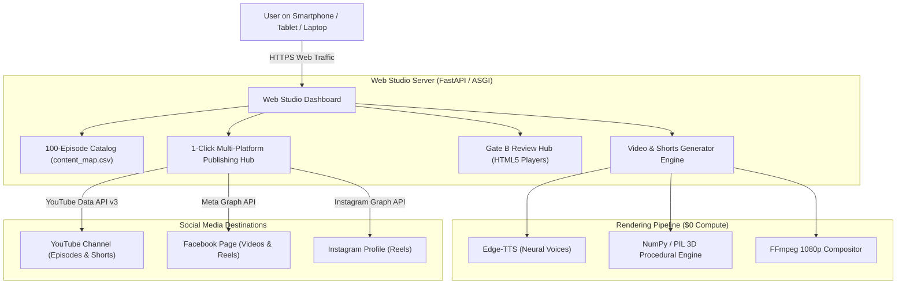

# History of Earth — Zero-Subscription Cloud Web Studio Architecture

**Generated:** 2026-09-29  
**Status:** Active Blueprint / Ready for Deployment Selection  
**Repository:** `https://github.com/ankurdasmailbox-hue/YTProject.git`

---

## 1. Executive Summary & Goals

The goal of this system is to **fully eliminate the need to open an IDE or run terminal commands** to generate and publish episodes and shorts for the *History of Earth* series.

### Key Capabilities:
- **Global Remote Access:** A clean, responsive Web Studio accessible from your smartphone, tablet, or laptop from anywhere in the world.
- **100-Episode Catalog:** Interactive grid directly synced with `content_map.csv`.
- **Asynchronous 1-Click Generation:** Click "Generate", and the system orchestrates scriptwriting, Edge-TTS audio, 3D procedural animations, and FFmpeg video compositing with live real-time log streaming.
- **In-Browser Gate B Review:** Watch the rendered 1080p Master MP4 and 9:16 vertical Shorts, preview thumbnails, and inspect SEO metadata inside the browser.
- **1-Click Multi-Platform Publishing:**
  - **YouTube:** 1080p Master Video + soft SRT caption tracks + vertical Shorts.
  - **Facebook:** Facebook Page Videos + Facebook Reels.
  - **Instagram:** Instagram Reels via Meta Graph API.
- **Strict Budget Constraint:** **$0.00 / month forever** (Zero Subscription).

---

## 2. Zero-Cost Cloud Deployment Comparison

| Metric | Option 1: Hugging Face Spaces *(Easiest 100% Cloud)* | Option 2: Oracle Cloud Always Free *(Dedicated 24/7 VPS)* | Option 3: Cloudflare Zero Trust Tunnel *(Fastest Render Speed)* |
| :--- | :--- | :--- | :--- |
| **Where Engine Runs** | 100% in Cloud (Docker/FastAPI) | 100% in Cloud (Ubuntu ARM VM) | Hybrid: Local AMD CPU + Cloud Web URL |
| **Monthly Cost** | **$0.00 forever** | **$0.00 forever** | **$0.00 forever** |
| **Can Local PC Be OFF?** | **YES** | **YES** | No (Local PC must be awake to render) |
| **Credit Card Needed?** | **NO** (Zero friction signup) | Yes (Identity verification only, $0 charged) | **NO** |
| **Specs & Resources** | 2 vCPU, 16 GB RAM, 50 GB storage | 4 ARM Ampere Cores, 24 GB RAM, 200 GB SSD | Uses your local PC specs (Ryzen AI CPU) |
| **Public Web URL** | `https://huggingface.co/spaces/<user>/history-studio` | `https://studio.yourname.duckdns.org` | `https://studio.yourname.trycloudflare.com` |
| **Security / Access** | Built-in Private Space switch + Password | Full SSH key + UFW Firewall + SSL | Cloudflare Zero Trust Access / Email OTP |
| **Render Speed (1080p)** | ~4–6 minutes per episode | ~3–4 minutes per episode | **~1.5 minutes (Ultra Fast: 50-60 fps)** |

---

## 3. Web Studio Architecture



---

## 4. Meta (Facebook & Instagram) API Checklist

While you set up your Facebook Page and Instagram profile, here is the exact checklist for Meta Developer integration:

1. **Facebook Page:** Create a public Facebook Page for the channel (e.g., *History of Earth*).
2. **Instagram Professional Account:**
   - Switch Instagram to a **Creator** or **Business** account.
   - In Instagram Settings > Linked Accounts, link it directly to your Facebook Page.
3. **Meta for Developers Portal:**
   - Go to `https://developers.facebook.com` and create an App (Type: **Business**).
   - Add permissions:
     - `pages_show_list`
     - `pages_read_engagement`
     - `pages_manage_posts`
     - `instagram_basic`
     - `instagram_content_publish`
4. **Environment Variables Needed** (Will be placed in `.env`):
   ```env
   FB_PAGE_ID=your_page_id
   FB_PAGE_ACCESS_TOKEN=your_never_expiring_page_token
   IG_USER_ID=your_instagram_business_account_id
   ```

---

## 5. Master Progress Snapshot

- **Master Content Map:** 100 Episodes generated and cleaned in `content_map.csv` (100% clean ASCII, zero mojibake).
- **Episode 1 (Milestone 1):** https://youtu.be/JkW7JcWnEzg
- **Episode 2 (The Magma Ocean & Moon Collision):**
  - Master Episode: https://youtu.be/Jkw7JcWnEzg
  - Short 1: https://youtube.com/shorts/q7yEw_bY_9s
  - Short 2: https://youtube.com/shorts/oD0N1T5K_2g
- **Episode 3 (Rain of Fire: First Oceans Form):**
  - Master Episode: https://youtu.be/d_Xeu3MUHzM
  - Short 1 (*"Why Earth's First Ocean Was Emerald Green"*): https://youtube.com/shorts/8bRVmlE8NEc
  - Short 2 (*"The Crushing 200-Atmosphere Poison Sky"*): https://youtube.com/shorts/X3fOK5cQEZk
  - Gate B Review: `review/gate_b_review_ep3.html`
- **Quality Mandates Preserved:**
  - 100% clean video without burned-in subtitles (YouTube soft SRT attached).
  - 3D procedural animations, camera tracking, and atmospheric depth.
  - High-CTR thumbnails with verified text bounding box safety.
